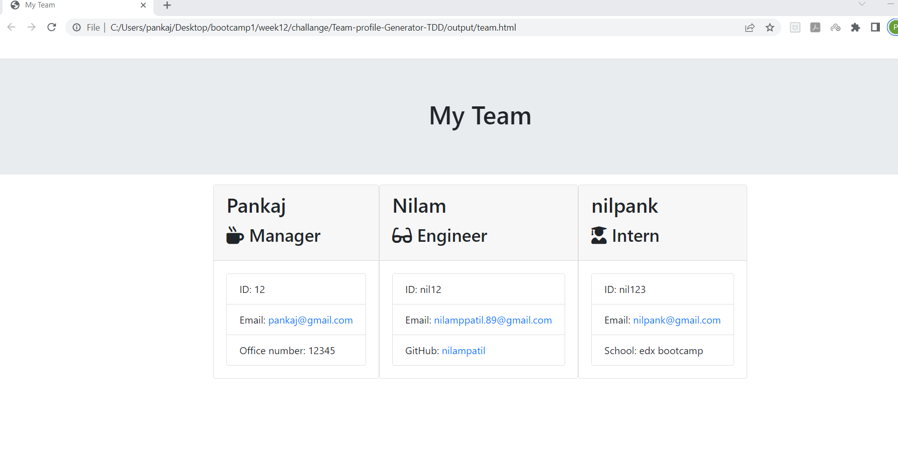
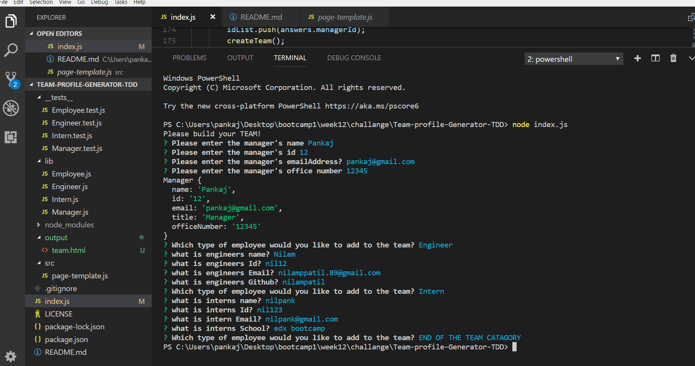

# Team-profile-Generator-TDD
# Github repo
https://github.com/nilamppatil/Team-profile-Generator-TDD
# Description
The project is designed to generate a team profile through a Node.js application that incorporates Object-Oriented Programming (OOP) and Test-Driven Development (TDD) using Jest. The application prompts users with questions via the terminal, and the responses are used to populate an HTML page that is generated by the program.
The project is built with a combination of HTML, CSS, and JavaScript languages, along with Node.js framework and Inquirer.js library for collecting user input. The application follows the principles of Object-Oriented Programming (OOP) and employs Test-Driven Development (TDD) methodology through Jest tests.

Below are the installation instructions for trying out the project on your local machine:

1 Clone or download the repository to your local machine.
2 Make sure the repository includes a package.json file with the required dependencies. If it is not present, you can create one by running the command npm init in your command line.
3 Install all the dependencies by running npm i or npm install in your terminal. Additionally, make sure to download Inquirer.js by running the command npm install inquirer in the root directory of the project. You can find more information about this package on the npm documentation.
4 Launch the application by running node index.js or node index in your terminal. This will initiate the first question in your terminal.
5 To ensure that the Jest tests work, run npm run test in your terminal and examine the output in the CLI.
